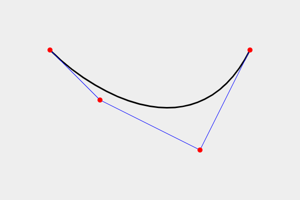

# Cubic B-Spline generator
좋은 품질의 Segmentation dataset 구축을 위하여, 주어진 점들을 지나는 부드러운 곡선 경로를 생성하는 기능을 구현한 javascript code입니다.

## Updates
2020-09-21: 자세한 설명을 추가하였습니다. 문의사항은 언제든지 jaewooklee at artiq dot kr로 메일 주시면 신속하게 답변드리도록 하겠습니다. 
  - 더블 클릭하면 곡선이 지워지는 이슈를 해결하였습니다. 
  - 점을 드래그할 수 있는 기능을 추가하였습니다.

## Demo Site
https://artiq.synology.me:909/

## Code Description
`app.js` 파일에 필요한 알고리즘을 모두 구현하였습니다. 먼저 구현한 자료구조 class들에 대해 설명드리겠습니다.

- `class Point`: 평면 상의 점은 **`x, y` 두 개의 property를 가진 instance**로 자연스럽게 표현하였습니다. 기본적인 사칙연산이 지원됩니다.

- `class Bezier`: 3차 베지어 곡선을 나타냅니다. 3차 베지어 곡선은 4개의 점에 의해 결정됩니다. 따라서 **4개의 Point를 포함하는 list**를 `points`라는 이름의 property로 갖고 있습니다.
  - `points`의 네 점을 순서대로 P0, P1, P2, P3이라 하면, 베지어 곡선은 P0에서 출발하여 P3에서 끝나는 특성이 있습니다. 그리고 일반적으로 P1과 P2는 지나지 않습니다.

이제 주요 함수에 대해 설명드리겠습니다.

- `Bezier.centripetalCatmullRomSpline`: n개의 점 P0, P1, ..., P(n-1)을 입력받고, 이들을 부드럽게 연결해주는 n개의 3차 베지어 곡선 B0, B1, ..., B(n-1)을 반환합니다. B0은 P0와 P1 사이를 부드럽게 이어주고, B1은 P1과 P2 사이를 부드럽게 이어줍니다. 마지막 B(n-1)은 P(n-1)과 P0 사이를 부드럽게 이어줍니다.
  - input: list of `Point`
  - output: list of `Bezier`

- `Bezier.evaluate`: 1개의 베지어 곡선을 입력받아, 곡선을 100등분하여 101개의 위치에서 샘플링한 후, 그 101개의 점으로 구성된 `Polyline`을 반환합니다. `Bezier`의 instance는 4개의 점만을 포함하고 있기 때문에, 이것을 실제로 그리기 위해서는 다각선으로 변형하는 과정이 필요합니다. 곡선을 100등분하여 101개의 점에서 샘플링하고, 그 **101개의 점을 모은 list**로 표현하였습니다.
  - input: `this` (`Bezier`의 instance)
  - ouptut: list of `Point`
  - 중요: 곡선 데이터 저장을 위해서는 `Bezier`들만 저장하면 충분합니다. `Polyline`은 `Bezier`만 있으면 언제든지 본 함수를 활용하여 동일한 모양으로 재생성이 가능합니다. `Polyline`은 단지 곡선을 그리기 위한 용도로만 임시로 활용됩니다.

## Theory

### 3차 베지어 곡선

위에서 `class Bezier`로 표현한 3차 베지어 곡선(Cubic Bézier Curve)은 3차 다항식을 활용하여 만들어진 부드러운 곡선입니다. HTML상에서는 `<svg>` 엘리먼트를 활용하여 3차 베지어 곡선을 그릴 수 있습니다. 
```HTML
<svg width="600" height="400" xmlns="http://www.w3.org/2000/svg" style="background-color: #eee" ;="">
        <path d="M 100 100 C 200 200, 400 300, 500 100" stroke="black" stroke-width="3" fill="transparent"></path>
        <path d="M 100 100 L 200 200 L 400 300 L 500 100" stroke="blue" fill="transparent"></path>
        <circle cx="100" cy="100" r="5" fill="red"></circle>
        <circle cx="200" cy="200" r="5" fill="red"></circle>
        <circle cx="400" cy="300" r="5" fill="red"></circle>
        <circle cx="500" cy="100" r="5" fill="red"></circle>
</svg>
```

위의 코드를 HTML `<body>`에 삽입하면 아래와 같은 이미지를 얻을 수 있습니다.



 `<svg>` 엘리먼트에서 네 개의 빨간색 점의 좌표는 왼쪽부터 각각
P0(100, 100), P1(200, 200), P2(400, 300), P3(500, 100)입니다. 평면 상에 네개의 점이 주어지면 하나의 3차 베지어 곡선을 결정할 수 있습니다. 다음의 [MDN 링크](https://developer.mozilla.org/en-US/docs/Web/SVG/Tutorial/Paths)를 참조하시면,

M 100 100 C 200 200 400 300 500 100

이라는 커맨드를 통해 3차 베지어 곡선 (검은색)을 그릴 수 있는 것을 확인할 수 있습니다. 따라서 검은색 곡선을 저장하기 위해서는 네개의 점 P0, P1, P2, P3의 좌표만 저장하면 됩니다.

그리고 3차 베지어 곡선의 중요한 성질로서, 곡선이 처음과 마지막 점인 P0, P3은 지나지만, P1, P2는 일반적으로 지나지 않는다는 사실을 알아두면 좋습니다. 대신 곡선은 P0, P1이 만드는 선분과 P0에서 접선이 일치하고, P2, P3이 만드는 선분과 P3에서 접선이 일치합니다.


### Centripetal Catmull–Rom spline
주어진 n개의 점을 모두 지나면서 매끈하게 연결되는 n개의 베지어 곡선을 생성하는 방법이 바로 B-spline입니다. 정확한 construction 방법은 여러가지가 있지만, 여기에서는 여러가지로 유용한 성질을 가지고 있는 Centripetal Catmull–Rom spline 방법을 사용하여 코드를 작성하였습니다.


## Reference
저희가 생성하는 곡선은 Centripetal Catmull-Rom spline으로 아래의 링크에 자세한 그림과 설명이 주어져 있습니다. 위키피디아 문서에 제시되어 있는 세가지 방법 중에서는 Uniform (α=0), Chordal (α=1)이 아닌 **Centripetal (α=1/2)** 방법을 적용하였는데, 저희가 실험해본 결과 Centripetal이 가장 적합한 모양의 곡선을 만들어내는 것으로 판단되었기 때문입니다.
- [https://qroph.github.io/2018/07/30/smooth-paths-using-catmull-rom-splines.html](https://qroph.github.io/2018/07/30/smooth-paths-using-catmull-rom-splines.html)
- [https://en.wikipedia.org/wiki/Centripetal_Catmull%E2%80%93Rom_spline](https://en.wikipedia.org/wiki/Centripetal_Catmull%E2%80%93Rom_spline)


## External Dependencies
- `fabric.js`를 활용하여 canvas를 조작하는 low-level 작업들을 대신하였습니다.